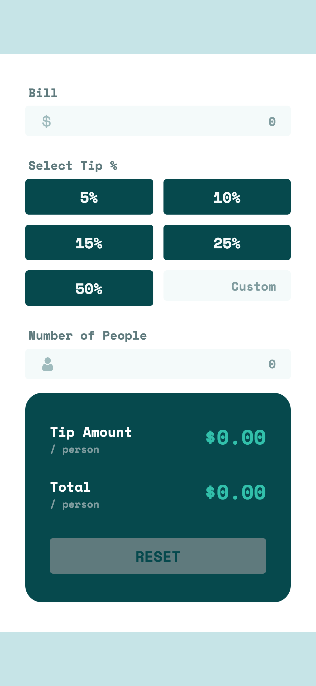

# Frontend Mentor - Tip calculator app solution

This is a solution to the [Tip calculator app challenge on Frontend Mentor](https://www.frontendmentor.io/challenges/tip-calculator-app-ugJNGbJUX).

## Table of contents

- [Overview](#overview)
  - [The challenge](#the-challenge)
  - [Screenshot](#screenshot)
- [My process](#my-process)
  - [Built with](#built-with)
  - [What I learned](#what-i-learned)
- [Author](#author)

## Overview

### The challenge

Users should be able to:

- View the optimal layout for the app depending on their device's screen size
- See hover states for all interactive elements on the page
- Calculate the correct tip and total cost of the bill per person

### Screenshot

Desktop

Mobile

### Links

- [Live Site URL](https://tip-calculator-app-chi.vercel.app/)

## My process

### Built with

- CSS custom properties
- CSS Grid
- Mobile-first workflow
- [React](https://reactjs.org/) - JS library
- [Styled Components](https://styled-components.com/) - For styles

### What I learned

Initially, I tackled this challenge without thinking too much about reusability and code efficiency. The challenge itself wasn't too difficult so finishing it wasn't the issue. Once I had created a "rough draft" of the app, I realized that there were too many overlapping styles and components that I had missed. So I went back and took the time to create utility styles and components that could be shared among most of the elements in the final app.

Hopefully, I'll get better at noticing elements that could essentially be slight modifications of each other. That way, I'll be able to create components efficiently, without having to write so much excess code.

## Author

- Website - [Hyun Don Moon](https://hyundonmoon.io)
- Frontend Mentor - [@hyundonny](https://www.frontendmentor.io/profile/hyundonny)
